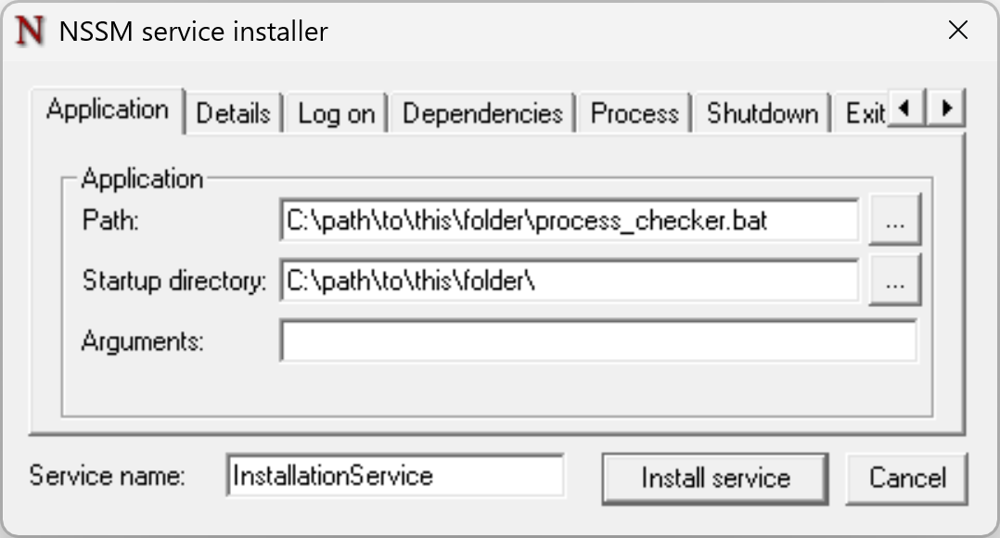
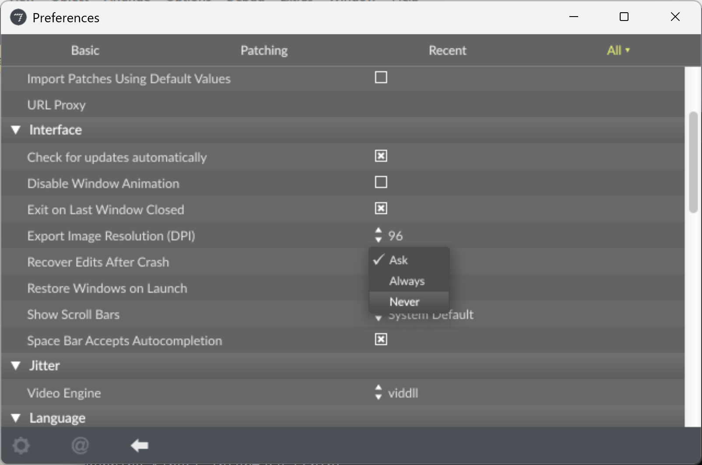

# Corpus Callosus
### Audiovisual installation at Cinematica Festival 2026
This repository provides some components to be used to set up the installation mentioned.

## Setup
Please, follow these steps to setup the main computer of the installation:
1. clone this repository
2. install a Python interpreter (these files have been tested with v. 3.13)
3. create a Python virtual environment, by opening `Command Prompt` or `PowerShell` and executing the following statements:
    - `python -m venv env`
    - `.\venv\Scripts\activate`
    - `pip install -r .\requirements.txt`
2. download [NNSM](https://nssm.cc/)
3. create a service named `InstallationService` (or any other name at your convenience) pointing to `process_checker.bat`, with the following statement:
    - `nssm.exe install InstallationService`
    - 
4. start the background service with `nssm.exe start InstallationService`; two Python scripts and Max should be running now
5. ensure that Max `Recover Edits After Crash` option is **not** set to `Ask` in the Max preferences, as in this screenshot; use `Always` or `Never` at your convenience and this will remove eventual human action needed at Max startup: 
6. replace `dsp_core.maxpat` file with the appropriate Max patcher for DSP, by preferably keeping the same name
5. reboot the system and ensure the service is running properly
